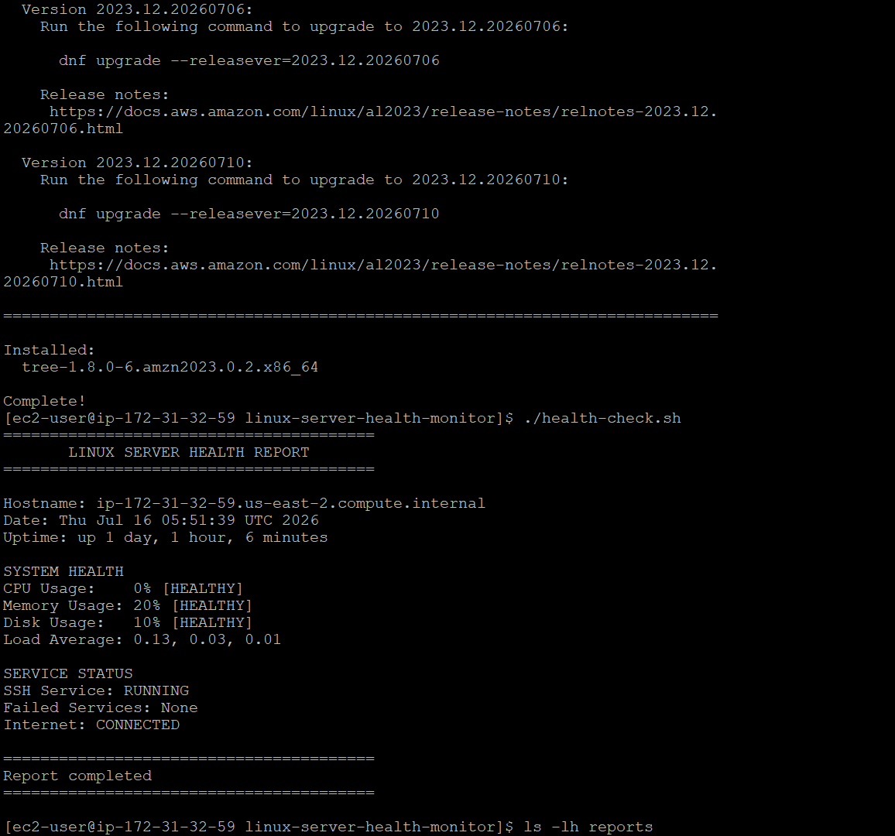
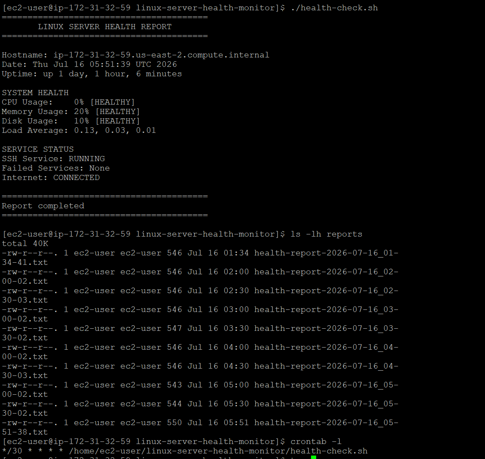
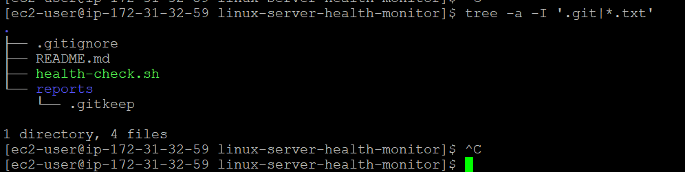

# Linux Server Health Monitor

A Bash-based Linux monitoring project that checks server health, classifies resource usage, saves timestamped reports, and runs automatically using cron.

## Features

* CPU usage monitoring
* Memory usage monitoring
* Disk usage monitoring
* Load average monitoring
* SSH service status check
* Failed systemd services detection
* Internet connectivity verification
* HEALTHY, WARNING, and CRITICAL status classification
* Timestamped report generation
* Automatic report storage
* Cron automation every 30 minutes

## Technologies Used

* Bash
* Amazon Linux 2023
* AWS EC2
* Cron
* systemd
* Linux command-line utilities

## Project Structure

```text
linux-server-health-monitor/
├── health-check.sh
├── README.md
├── .gitignore
└── reports/
    └── .gitkeep
```

## How It Works

The script collects server health information using Linux commands such as:

* `free`
* `df`
* `vmstat`
* `uptime`
* `systemctl`
* `ping`

CPU, memory, and disk usage are classified using the following thresholds:

* Below 70%: HEALTHY
* 70% to 84%: WARNING
* 85% or higher: CRITICAL

## Run the Script

Make the script executable:

```bash
chmod +x health-check.sh
```

Run it manually:

```bash
./health-check.sh
```

Each execution creates a timestamped report inside the `reports` directory.

Example:

```text
reports/health-report-2026-07-16_05-30-02.txt
```

## Cron Automation

The script is scheduled to run every 30 minutes:

```cron
*/30 * * * * /home/ec2-user/linux-server-health-monitor/health-check.sh
```

View the current cron configuration:

```bash
crontab -l
```

## Sample Output

```text
========================================
       LINUX SERVER HEALTH REPORT
========================================

SYSTEM HEALTH
CPU Usage:    0% [HEALTHY]
Memory Usage: 17% [HEALTHY]
Disk Usage:   10% [HEALTHY]
Load Average: 0.00, 0.00, 0.00

SERVICE STATUS
SSH Service: RUNNING
Failed Services: None
Internet: CONNECTED
```

## Real-World Use Case

Linux administrators and Cloud/DevOps engineers use automated health checks to identify resource problems, verify critical services, confirm network connectivity, and preserve reports for troubleshooting.

## Skills Demonstrated

* Linux system administration
* Bash scripting
* Resource monitoring
* systemd service management
* Cron scheduling
* File and directory management
* Logging and troubleshooting
* AWS EC2 administration

## Future Improvements

* Email or Slack alerts
* Log rotation and retention
* Configurable thresholds
* Monitoring multiple servers
* CloudWatch integration
## 📸 Screenshots

### Health Monitor Output



### Automated Reports and Cron



### Project Structure


